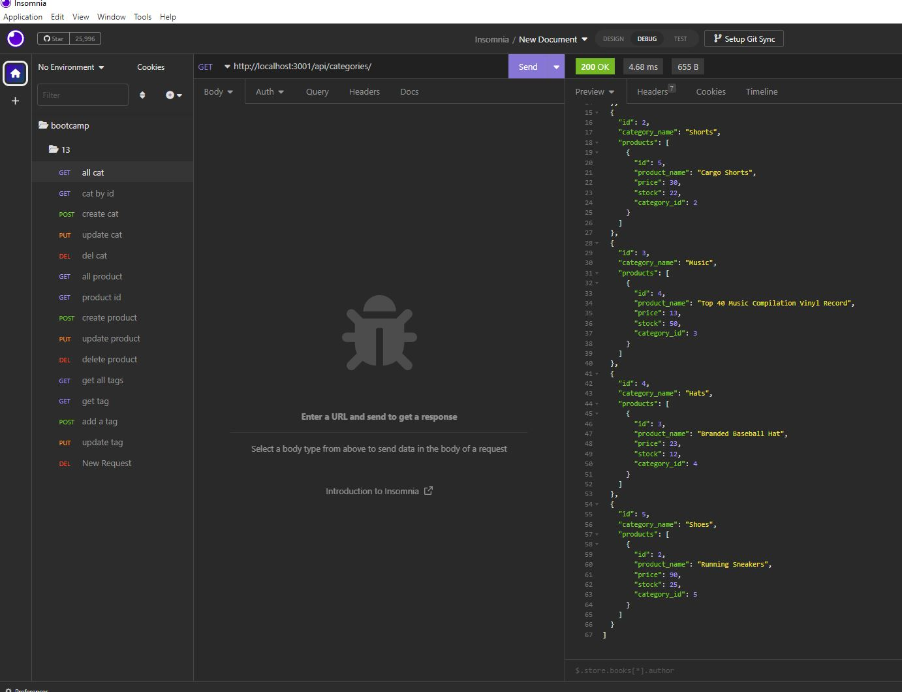

# Ecomerce-Backend-13
    Backend application to view create update and delete databases.

## Description

This is an employee tracker that can view, or add, departments, roles, and employees and insert them into mysql tables.

## Table of Contents

- [Installation](#installation)
- [Usage](#usage)
- [Credits](#credits)
- [License](#license)

## Installation

- express
- mysql2
- sequilize
- dotenv

## Usage

Use MySql to create database. Run NPM I and NPM seed to instal dependencies and seed data. Run server with NPM start and Navigate and edit via insomnia

Demo : https://drive.google.com/file/d/1bjgZ1bW2AOMbcD_ii2KIqfhWwGbQOI5F/view

## Credits

-100mph class no breaks

## License

N/A